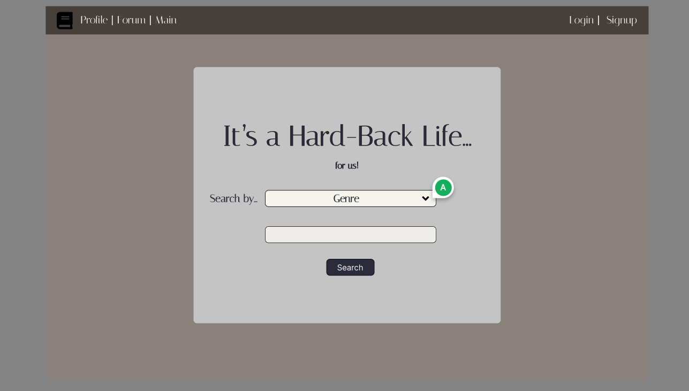
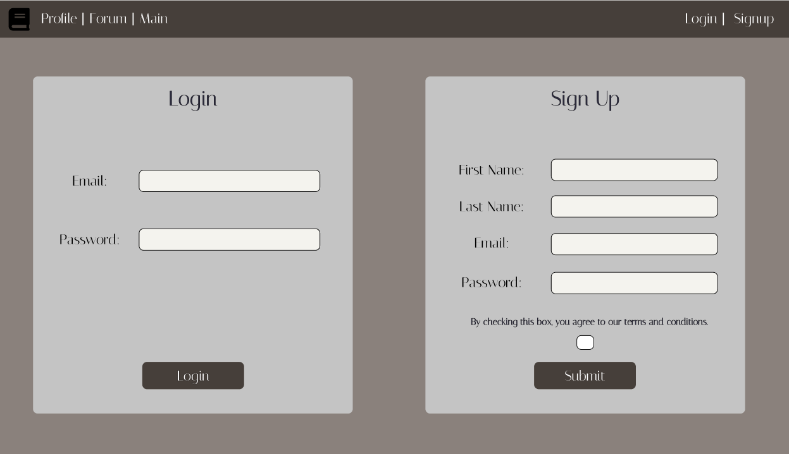
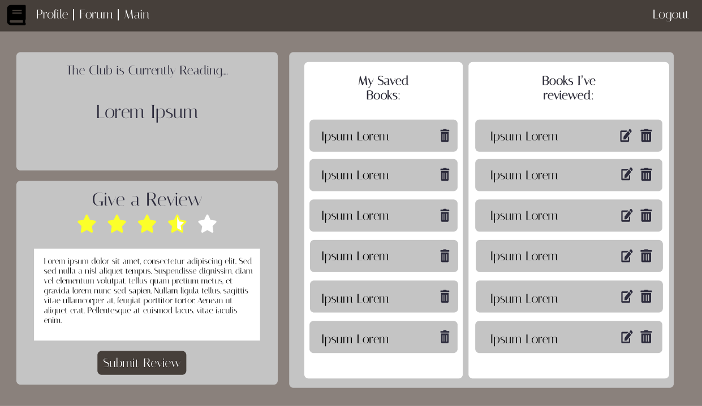
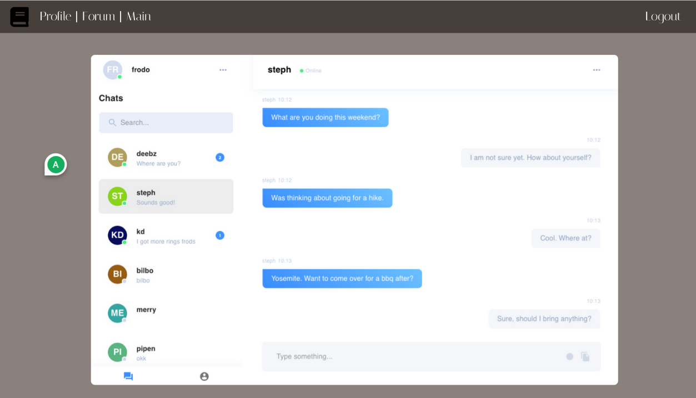
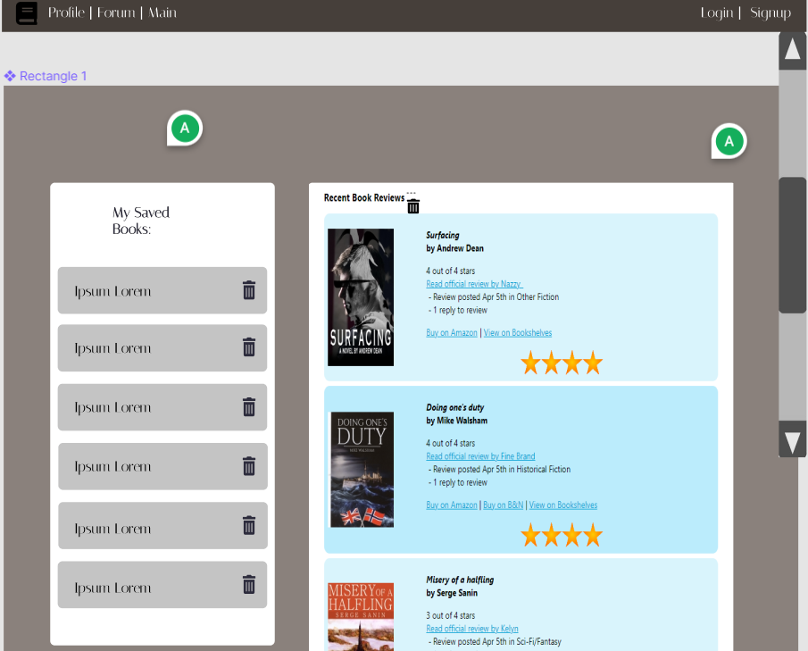
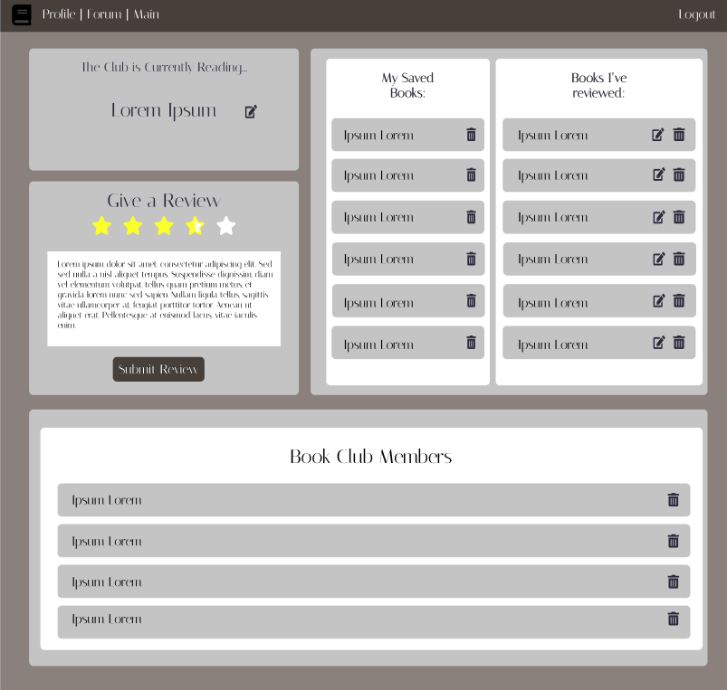

# It's A Hardback Life Book Club
## Description
It's A Hardback Life Book Club is a book club application that has client and admin logins, the ability to search and save books, and save book reviews. It utilizes the OpenLibrary API and allows users to chat about their favorite books in real time.

## Table of Contents
- [Wireframe](#wireframe)
- [Instructions](#instructions)
- [Usage](#usage)
- [User Story](#user-story)
- [Strengths and Challenges](#strengths-and-challenges)
- [Future Directions](#future-directions)
- [Credits](#credits)
- [License](#license)

## Wireframe
Our initial mock-up utilizing Figma.

Landing Page:<br>


Login:<br>


Profile:<br>


Chat Box:<br>


Search Results:<br>


Admin Profile:<br>


## Instructions

To see admin functionality, contact one of the creators.

Otherwise, create a basic user account with our signup page.

## Usage
Visit the [deployed application here](https://a-hardback-life.herokuapp.com/).

Check out the following demo of the application:<br>


## User Story

```
AS AN avid reader,
I WANT to discuss books with other readers and leave reviews
SO THAT I can share information with my community about books we love.
```


## Roles/Tasks
- [Alex](https://github.com/amachkel) : Backend Development / Frontend Development
- [Amanda](https://github.com/Quadrilateral0) : Backend Development / Frontend Development
- [Chance](https://github.com/ChanceSupcoe) : Frontend Development
- [Earl](https://github.com/Bballplayer33) : Backend Development
- [Kris](https://github.com/DivorceSurvivor) : Frontend Development


## Strengths and Challenges
- Challenges:
    - GitHub Merge Conflicts
    - Vue.js Issues Pushing to Heroku

- Strengths: 
    - Teamwork
    - Communication
    - API Integration

## Future Directions
- UI Enhancements
- CSS Polishing
- Added Admin Functions
- Realtime On/Offline Chat Feature
- Profile Pictures
- Review Edit Feature

## Credits
A thanks to our resources:
- [OpenLibrary API](https://openlibrary.org/dev/docs/api/books)
- [Pusher API](https://pusher.com/docs/)
- [Handlebars](https://handlebarsjs.com/guide/)
- [MySQL](https://www.mysql.com/)
- [Node.js](https://nodejs.dev/learn/introduction-to-nodejs) 
- [Express.js](https://expressjs.com/)
- [Vue.js](https://vuejs.org/guide/quick-start.html)
- [Figma](https://www.figma.com/)
- [Screencastify - Chrome Extension](https://www.screencastify.com/?gclid=Cj0KCQiAgP6PBhDmARIsAPWMq6kirDwVSm0ryb7sQeSxVQuZG-G7kk9ikfSz77SBh-fA7QS9aKdyjgAaAgJGEALw_wcB)
- [Visual Studio Code](https://code.visualstudio.com/download)
- [Expandable Cards Codepin](https://codepen.io/brussell98/pen/mEwxjP)
- [Unsplash Photo by 🇸🇮 Janko Ferlič](https://unsplash.com/@itfeelslikefilm?utm_source=unsplash&utm_medium=referral&utm_content=creditCopyText)

## License

